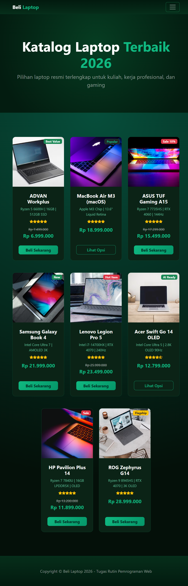
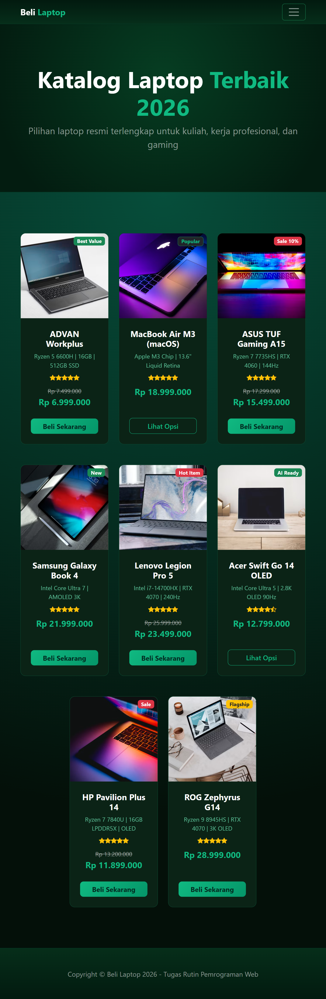
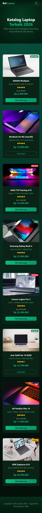

# 💻 Katalog Laptop 2026

Proyek website katalog produk bertema **Dark Emerald Green** yang dirancang responsif, modern, dan interaktif. Website ini memuat daftar produk laptop unggulan lengkap dengan spesifikasi, ulasan rating, potongan harga khusus, dan fitur interaktif keranjang belanja.

Proyek ini dibuat untuk memenuhi **Tugas Rutin Pertemuan 3 - Pemrograman Web**.

---

## ✨ Fitur Utama

- 🎨 **Modern Emerald Dark Theme:** Tampilan visual elegan dengan perpaduan warna hitam pekat, aksen hijau zamrud (*emerald*), dan efek cahaya neon.
- 📱 **Desain Sepenuhnya Responsif:** Tata letak grid adaptif menggunakan sistem Bootstrap 5 dan tipografi dinamis dengan CSS `clamp()` yang optimal di tampilan Desktop, Tablet, maupun Ponsel.
- 🛒 **Interaktivitas Keranjang Belanja:** Dilengkapi animasi penambahan jumlah barang pada badge keranjang (*live counter*) dan efek feedback konfirmasi saat tombol produk diklik.
- 🏷️ **Informasi Produk Lengkap:** Menampilkan foto produk berkualitas tinggi, label kategori/promo (*Best Value, Hot Item, AI Ready, Sale*), harga diskon, ulasan rating bintang, serta ringkasan spesifikasi teknis.
- ⚡ **Ringan & Cepat:** Dibangun menggunakan Vanilla HTML5, CSS3 murni, dan JavaScript tanpa *overhead library* yang berat.

---

## 📸 Preview Tampilan

| Desktop View (1200px) | Tablet View (768px) | Mobile View (375px) |
| :---: | :---: | :---: |
|  |  |  |

---

## 🛠️ Teknologi yang Digunakan

- **HTML5:** Struktur semantik dokumen web.
- **CSS3:** Custom styling, gradien, transisi halus, efek *glassmorphism*, dan tipografi responsif.
- **Bootstrap 5.2.3:** Framework CSS untuk grid layout dan komponen UI.
- **Bootstrap Icons 1.5.0:** Kumpulan ikon visual.
- **Vanilla JavaScript:** Logika DOM untuk interaksi counter keranjang dan feedback tombol.

---

## 📂 Struktur Direktori

```text
TugasWeb-Pertemuan3-Katalog/
├── assets/
│   ├── css/
│   │   └── styles.css          # File style gabungan Bootstrap dan custom Emerald theme
│   ├── js/
│   │   └── scripts.js          # Logika interaktivitas JavaScript
│   ├── screenshots/            # Tangkapan layar tampilan responsif
│   │   ├── desktop-1200px.png
│   │   ├── tablet-768px.png
│   │   └── mobile-375px.png
│   └── favicon.svg             # Ikon logo tab browser (SVG)
├── index.html                  # Halaman utama katalog
└── README.md                   # Dokumentasi proyek
```

---

## 🚀 Cara Menjalankan Proyek Secara Lokal

1. **Clone repository ini:**
   ```bash
   git clone https://github.com/raptamayahya21-prb/TugasWeb-Pertemuan3-Katalog.git
   ```

2. **Masuk ke direktori proyek:**
   ```bash
   cd TugasWeb-Pertemuan3-Katalog
   ```

3. **Buka file `index.html`:**
   - Cukup klik ganda pada file `index.html` untuk membukanya langsung di browser favorit Anda, **atau**
   - Jalankan menggunakan extension **Live Server** di Visual Studio Code untuk pengalaman pengembangan terbaik.

---

## 👨‍💻 Pengembang

- **Nama:** Raptama Yahya
- **Mata Kuliah:** Pemrograman Web
- **Universitas:** Universitas Negeri Medan (UNIMED)

---

## 📄 Lisensi

Proyek ini dirilis di bawah lisensi [MIT License](LICENSE). Bebas digunakan untuk keperluan edukasi dan pembelajaran.
